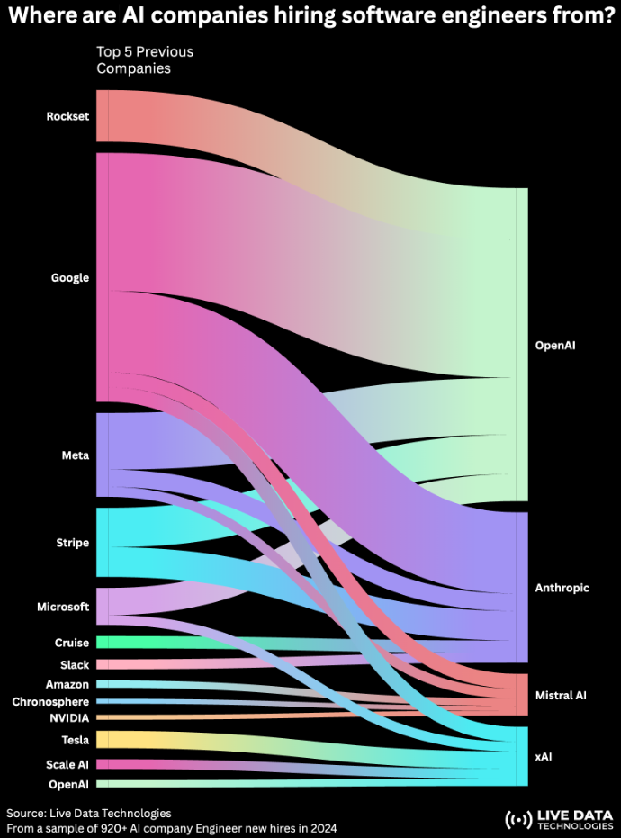

# IA Top Companies

OpenAI, Anthropic, xAI, and Mistral, are the hottest AI companies

De donde vienen los ingenieros que contratan estas 4 compañias? La respuesta en el grafico:

Most common sources of hires by company:

- **OpenAI**: Google, Meta, Stripe, Rockset, Microsoft
- **Anthropic**: Google, Meta, Stripe, Cruise, Slack
- **xAI**: Tesla, Google, Scale AI, OpenAI
- **Mistral**: Google, Meta, Amazon, NVIDIA, Chronosphere