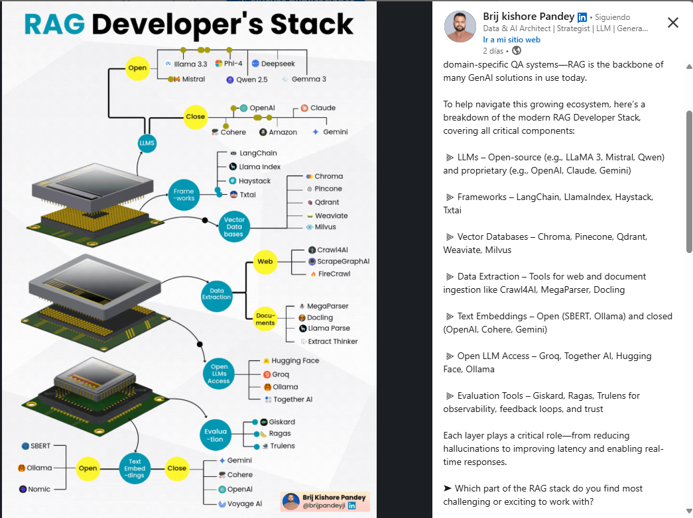
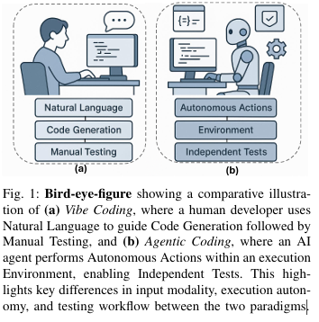
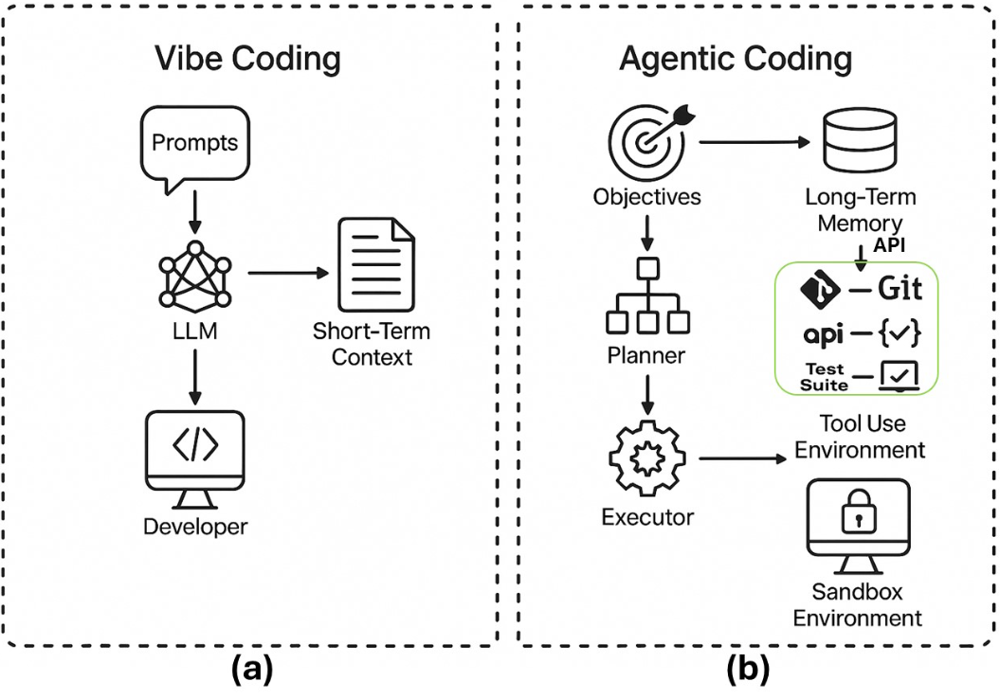

# IA

- El curso de DataCamp
- Los videos de youtube para crear un agente AI con N8N
- Continuar con el libro de Generative IA Dummi que esta en la carpeta (pag 17)
- Udemy
- Learning Analytics (barra de favoritos)
- Agents Course - Hugging face (barra de favoritos)
- [**Introduction to Transformers and Attention Mechanisms**](https://courses.analyticsvidhya.com/courses/take/introduction-to-transformers-and-attention-mechanisms/lessons/62515641-understanding-rnn)
- [**GenAI_Agents**](https://github.com/NirDiamant/GenAI_Agents)
- [Inteligencia Artificial Generativa](https://github.com/microsoft/generative-ai-for-beginners/blob/main/translations/es/01-introduction-to-genai/README.md?WT.mc_id=academic-105485-koreyst)

Publicaciones guardadas

[https://www.linkedin.com/my-items/saved-posts/](https://www.linkedin.com/my-items/saved-posts/)

The Tokenizer Playground: Ejemplos de como funcionan los tokens (poner esto en la web)

[https://courses.analyticsvidhya.com/certificates/wewqh58zyf](https://courses.analyticsvidhya.com/certificates/wewqh58zyf)

April 9, 2025 

Ya tengo instalado ollama en la maquina, se puede acceder a traves de linea de comandos y responde preguntas (en el mismo CMD)

Tengo un ejemplo de python que utiliza ollama y contesta preguntas, para usarlo utilice el comando: pip install ollama lo ejecute en la consola y quedo instalado, luego ejecute el ejemplo de python y funciono (respondio preguntas)

---

[**LLM** ](LLM%203024aa4939ac43b3bf686bfeab956202.md)

[RAG (Retrieval Augmented Generation)](RAG%20(Retrieval%20Augmented%20Generation)%20178c2187ea12804d94a8f801e24078ca.md)

[**Prompt Engineering**](Prompt%20Engineering%20a1db65f94f614990bf1e97629a3ac142.md)

[**IA Generativa**](IA%20Generativa%207867e84e097d43d7900410b515fdadd4.md)

[Tokenización (Tokenization)](Tokenizaci%C3%B3n%20(Tokenization)%20181c2187ea12809d8d4ed8dee572e172.md)

[[**Hugging Face**](https://huggingface.co/)](Hugging%20Face%201a4c2187ea128028a22ff8a7cb2462b8.md)

### Others AI

[Analytics Vidhya](Analytics%20Vidhya%20181c2187ea12803ba22aee22ecdab003.md)

[Federated Learning ](Federated%20Learning%20170c2187ea1280b1afeed7c5fcc273c8.md)

[IA Top Companies](IA%20Top%20Companies%20158c2187ea12801a9b02ce57152910de.md)

### Los grandes modelos lingüísticos (LLMs) son un subconjunto de NLP que generan respuestas textuales similares a las humanas

[30 AI Projects You Can Build This Weekend](https://drive.google.com/file/d/1RT9nTK98Tz9b1S4SFkTUSziLY_oHUrT2/view)

### **Orchestration Frameworks**: LangChain and Llama Index:

LangChain es un marco de trabajo de código abierto para crear aplicaciones basadas en modelos de lenguaje de gran tamaño (LLM). 

Los LLM son grandes modelos de aprendizaje profundo entrenados previamente con grandes cantidades de datos que pueden generar respuestas a las consultas de los usuarios, por ejemplo, responder preguntas o crear imágenes a partir de peticiones basadas en texto. 

LangChain proporciona herramientas y abstracciones para mejorar la personalización, precisión y relevancia de la información que generan los modelos. Por ejemplo, los desarrolladores pueden usar los componentes de LangChain para crear nuevas cadenas de peticiones o personalizar las plantillas existentes. 

LangChain también incluye componentes que permiten a los LLM acceder a nuevos conjuntos de datos sin necesidad de repetir el entrenamiento.

Practical experience with orchestration frameworks like LangChain and Llama Index and Amazon SageMaker

- Cuales son los Agentes AI para dllo de sw
- Primero fueron los LLMs luego Agentes AI
- Analisis, dev y pruebas de un pagador solo con agentes?
- Lo verdaderamente poderoso deberia ser la capacidad para la toma de desiciones

Consideraciones al momento de usar la IA:

𝗧𝗼𝗽 𝗚𝗲𝗻𝗲𝗿𝗮𝘁𝗶𝘃𝗲 𝗔𝗜 𝗧𝗲𝗿𝗺𝘀 𝗬𝗼𝘂 𝗦𝗵𝗼𝘂𝗹𝗱 𝗞𝗻𝗼𝘄 — 𝗘𝘅𝗽𝗹𝗮𝗶𝗻𝗲𝗱 𝗦𝗶𝗺𝗽𝗹𝘆

𝟭. 𝗟𝗟𝗠 (𝗟𝗮𝗿𝗴𝗲 𝗟𝗮𝗻𝗴𝘂𝗮𝗴𝗲 𝗠𝗼𝗱𝗲𝗹)

→ Helps computers understand and write human-like text

→ Examples: GPT-4, Claude, Gemini

→ Used in: Chatbots, coding tools, content generation

𝟮. 𝗧𝗿𝗮𝗻𝘀𝗳𝗼𝗿𝗺𝗲𝗿𝘀

→ The tech behind all modern AI models

→ Let models understand meaning, context, and order of words

→ Examples: BERT, GPT

𝟯. 𝗣𝗿𝗼𝗺𝗽𝘁 𝗘𝗻𝗴𝗶𝗻𝗲𝗲𝗿𝗶𝗻𝗴

→ Writing better instructions to get better AI answers

→ Includes system prompts, step-by-step prompts, and safety rules

𝟰. 𝗙𝗶𝗻𝗲-𝗧𝘂𝗻𝗶𝗻𝗴

→ Training an AI model on your data

→ Helps tailor it for specific tasks like legal, medical, or financial use cases

𝟱. 𝗘𝗺𝗯𝗲𝗱𝗱𝗶𝗻𝗴𝘀

→ A way for AI to understand meaning and relationships between words or documents

→ Used in search engines and recommendation systems

𝟲. 𝗥𝗔𝗚 (𝗥𝗲𝘁𝗿𝗶𝗲𝘃𝗮𝗹-𝗔𝘂𝗴𝗺𝗲𝗻𝘁𝗲𝗱 𝗚𝗲𝗻𝗲𝗿𝗮𝘁𝗶𝗼𝗻)

→ Combines AI with a database or document store

→ Helps AI give more accurate, fact-based answers

𝟳. 𝗧𝗼𝗸𝗲𝗻𝘀

→ The chunks of text AI reads and writes

→ Managing them controls cost and performance

𝟴. 𝗛𝗮𝗹𝗹𝘂𝗰𝗶𝗻𝗮𝘁𝗶𝗼𝗻

→ When AI gives wrong or made-up answers

→ Can be fixed with fact-checking and better prompts

𝟵. 𝗭𝗲𝗿𝗼-𝗦𝗵𝗼𝘁 𝗟𝗲𝗮𝗿𝗻𝗶𝗻𝗴

→ When AI can perform a task without being trained on it

→ Saves time on training

𝟭𝟬. 𝗖𝗵𝗮𝗶𝗻-𝗼𝗳-𝗧𝗵𝗼𝘂𝗴𝗵𝘁

→ AI explains its answer step-by-step

→ Helps with complex reasoning tasks

𝟭𝟭. 𝗖𝗼𝗻𝘁𝗲𝘅𝘁 𝗪𝗶𝗻𝗱𝗼𝘄

→ The amount of info AI can see at once

→ Larger windows help with longer documents or conversations

𝟭𝟮. 𝗧𝗲𝗺𝗽𝗲𝗿𝗮𝘁𝘂𝗿𝗲

→ Controls how creative or predictable AI is

→ Lower values = more accurate; higher values = more creative

𝗪𝗵𝗮𝘁’𝘀 𝗖𝗼𝗺𝗶𝗻𝗴 𝗡𝗲𝘅𝘁?

→ Multimodal AI (text, images, audio together)

→ Smaller, faster models

→ Safer, ethical AI (Constitutional AI)

→ Agentic AI (autonomous, task-completing agents)

Knowing the terms is just step one — what really matters is how you 𝘶𝘴𝘦 them to build better solutions.

RAG Developer Stack

## [Vibe Coding](https://huggingface.co/papers/2505.19443)  vs.  [Agentic Coding](https://arxiv.org/pdf/2505.19443)

Vibe Coding integrates principles from prompt engineering, agile design, and human-AI co-creation, while abstracting much of the linguistic burden onto the LLM. Vibe Coding, a term popularized by Andrej Karpathy Andrej Karpathy, describes a software development methodology centered on the developer’s intuitive expression of intent to an LLM, which then acts as a highly responsive co-pilot in generating code

Agentic coding (Figure 1b) is grounded in the deployment of agentic AI systems software agents capable of independently interpreting high-level goals, decomposing tasks into subtasks, planning execution strategies, and adapting behavior based on real-time feedback and outcomes Unlike the prompt-response dynamic of vibe coding, agentic coding minimizes the need for continuous human oversight

While **Vibe Coding** represents a leap in developer productivity and human-AI interaction, **Agentic coding** signifies a more advanced and autonomous evolution of AI-assisted programming.

Understanding the distinction between Vibe Coding and Agentic coding is crucial for navigating the future landscape of AI-assisted software development. Vibe coding maintains a human-centric model, where the developer is an ever-present conductor guiding the AI’s output a model well-suited to creative ideation, exploratory development, and rapid iteration. Agentic coding, on the other hand, introduces AI agents as semi-autonomous collaborators, shifting the human role to that of a supervisor who defines goals and evaluates outcomes

Vibe Coding resume: The developer provides an initial prompt; the LLM generates a code artifact; the developer reviews, critiques, and refines the prompt or directly edits the code, continuing the cycle until the desired ”vibe” is achieved [31], [32]. This iterative refinement loop is a defining characteristic, reflecting a co-constructive model of meaning-making between human and machine

Agentic coding as illustrated in Figure 3 represents a paradigmatic shift in AI-assisted software engineering. Unlike vibe coding, where LLMs operate as conversational co-pilots [59], [60], agentic coding systems delegate substantial cognitive and operational responsibility to autonomous or semi-autonomous software agents. These agents are capable of planning, executing, and verifying complex software tasks transforming natural language instructions into robust, testable code with minimal human guidance. 
The core philosophy of agentic coding is delegated autonomy. Developers specify high-level objectives such as “integrate an external API,” “refactor backend routing,” or “set up CI workflows,” while the agent assumes responsibility for determining and executing the steps needed to accomplish those goals. This transforms the human’s role from low-level implementer to a systemlevel supervisor and goal-setter.

Although both vibe coding and agentic coding harness LLMs to augment software development as depicted in Figure 5, their architectural intent and implementation are fundamentally distinct. Vibe Coding (Figure 5a) operates through developer-initiated, prompt-based interactions within IDEs or web-based environments, emphasizing conversational co-creation and low-friction prototyping. In contrast, Agentic Coding (Figure 5b) is grounded in delegated autonomy: developers specify high-level objectives, and intelligent agents often composed of planner, executor, and toolchain modules carry out multi-step coding workflows, potentially invoking compilers, APIs, test runners, and version control systems without continuous human supervision

Our findings suggest that successful AI software engineering will rely not on choosing one paradigm, but on harmonizing their strengths within a [unified](https://huggingface.co/papers?q=unified), human-centered development lifecycle.

Context Engenniering

Que es un RPA:  
Un RPA, o Automatización Robótica de Procesos, **es una tecnología que utiliza "bots" de software para automatizar tareas repetitivas y basadas en reglas que normalmente realizaría un humano**. Estos bots imitan las acciones humanas al interactuar con sistemas y aplicaciones digitales, como introducir datos, procesar transacciones y mover archivos, liberando a los empleados para que se enfoquen en tareas más estratégicas y complejas. 

Por ejemplo,

1. Los Chatbots basados en LLM: Si preguntas, responden. Pero no planifican ni usan herramientas de forma dinámica y su memoria es mínima.

2. El RPA tradicional.. Pueden ejecutar scripts, llamar APIs o incluso invocar a un LLM… pero siempre bajo la misma secuencia. son ideales para tareas repetitivas, pero no reaccionan ante cambios.

3. RAG básico recupera información, se la pasa al modelo, genera texto...pero no decide, no redefine el flujo y muchos menos planifica.

Entonces, ¿qué sí es Agentic AI?

- Un agente combina capacidades que le dan autonomía operativa.
- Tiene memoria útil, capaz de manejar contexto inmediato y también información a largo plazo.
- Puede planificar sistemas.
- Utiliza herramientas de forma inteligente encadenándolas según lo que observa en cada etapa.
- Mejora constantemente gracias al feedback
- Y puede coordinar a varios agentes especializados para completar tareas complejas.